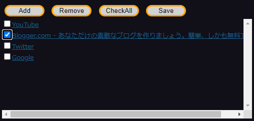

tmp ReadingList  
====  
## Description  
tmp ReadingList is Reading List is a simple site URL storage tool available as a Chrome extension.  

  

## Features 
* Add the page title and URL  
* Remove items checked in the checkboxes  
* Check all checkboxes   
* Output the list to a csv file      

## Licence  
MIT  

## Author  
tk87s